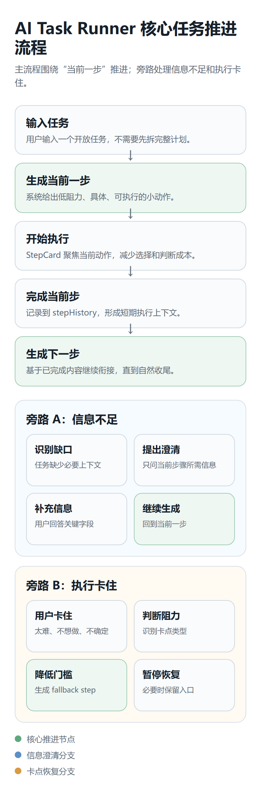

# AI Task Runner MVP

AI Task Runner 是一个面向个人任务启动与推进的本地 Web 应用。它不追求一次性生成完整计划，而是把用户当前任务拆成一个低阻力、可立刻执行的步骤，并在用户完成、卡住或信息不足时继续推进。



## 项目价值

很多 AI 工具会给用户一份完整计划，但真正卡住的地方通常是“现在到底先做哪一步”。这个项目把 AI 放进任务执行闭环里，重点处理三件事：

- 启动任务：把开放任务转成当前最小可执行动作。
- 持续推进：用户完成一步后，根据历史步骤生成自然衔接的下一步。
- 阻力恢复：用户卡住时，识别阻力类型并生成更低压力的 fallback step。

## 核心功能

- 任务列表：创建、进入、标记重要、删除任务。
- 当前步骤推进：输入任务后生成第一步，完成后继续生成下一步。
- StepCard：统一承载当前行动、执行状态、完成动作、卡点入口和恢复入口。
- 澄清流程：信息不足时先问一个关键问题，再继续生成具体步骤。
- 卡点恢复：处理太难、不想做、不确定、状态不适合等执行阻力。
- 完成判断：简单任务在完成 2 步或遇到重复步骤时进入完成确认。
- 本地持久化：使用 `localStorage` 保存任务列表和执行进度。

## 技术栈

- Frontend: React, Vite, localStorage
- Backend: Express
- AI Provider: DeepSeek API
- Tests: Node.js scripts, Vite build
- Demo assets: static screenshots, Remotion flow demo assets

## 项目结构

```txt
ai-task-runner-mvp/
  client/          React + Vite frontend
  server/          Express API and AI provider services
  docs/            Showcase, architecture, quality and portfolio materials
  public/          Static screenshots and demo frames used by the app/docs
  scripts/         Capture and render helper scripts
  video/           Remotion demo compositions
  figma-import/    Figma import scripts and plugin experiments
```

更多架构说明见 [docs/architecture.md](docs/architecture.md)。

## 本地运行

安装依赖：

```bash
npm install
npm --prefix client install
npm --prefix server install
```

复制环境变量示例：

```bash
cp server/.env.example server/.env
```

然后在 `server/.env` 填入真实 API key：

```env
DEEPSEEK_API_KEY=your_deepseek_api_key_here
DEEPSEEK_API_URL=https://api.deepseek.com/chat/completions
DEEPSEEK_MODEL=deepseek-chat
PORT=3001
```

启动开发环境：

```bash
npm run dev
```

访问地址：

```txt
Frontend: http://localhost:5173
Backend:  http://localhost:3001
```

## 验证

```bash
npm run build
npm run test:all
```

当前验证记录见 [docs/verification.md](docs/verification.md)。

## 展示材料

- 演示脚本：[docs/showcase-script.md](docs/showcase-script.md)
- 质量清单：[docs/quality-checklist.md](docs/quality-checklist.md)
- 作品集案例页：[docs/portfolio/ai-task-runner-case-study.html](docs/portfolio/ai-task-runner-case-study.html)
- 截图素材：[docs/portfolio/assets/](docs/portfolio/assets/)

在线 Demo 暂未部署。当前仓库提供本地 Demo、截图和演示脚本；如果要部署，建议先把前端静态页面部署到 Vercel，再把后端部署到支持环境变量的 Node.js 平台。

## GitHub 发布检查

- `server/.env`、`.env*`、日志、`node_modules/`、`dist/`、`.tmp*/`、`.tmp-screenshots/`、`.tmp-ui-audit/`、`video/out/` 已通过 `.gitignore` 排除。
- `server/.env.example` 只包含占位符，可以提交。
- 提交前运行 `git status --short --ignored`，确认脏文件只出现在 ignored 列表中。
