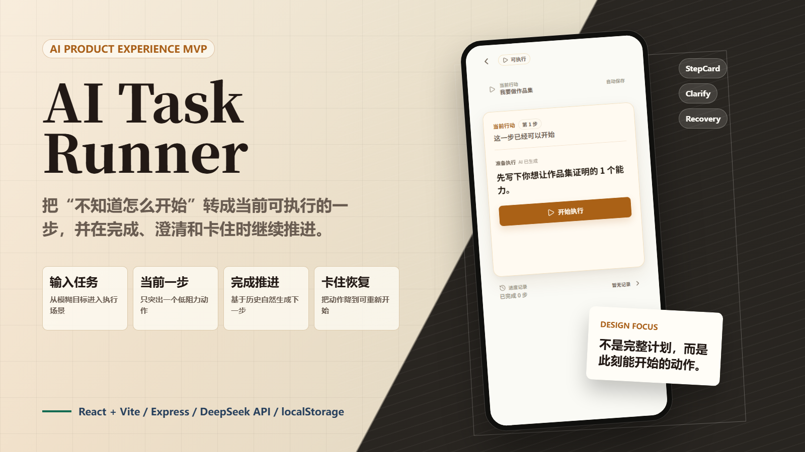
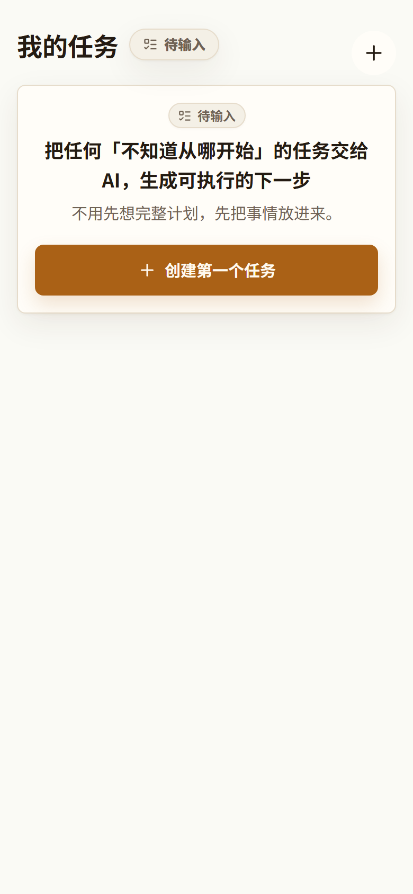
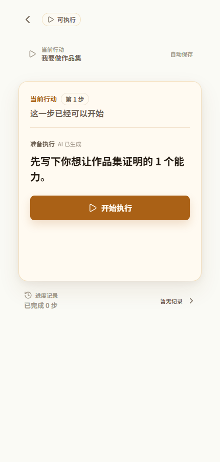
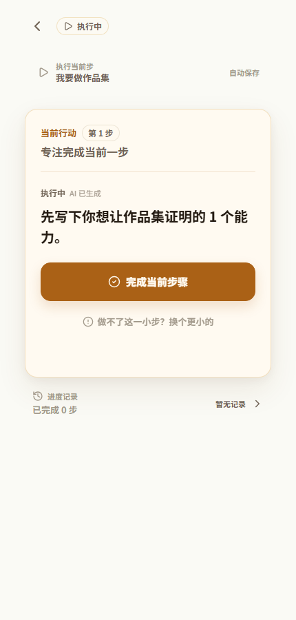
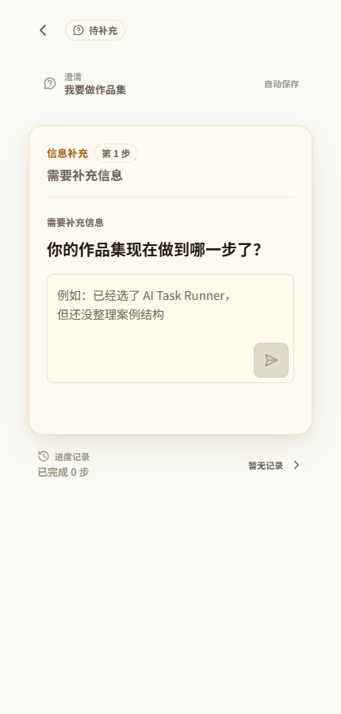
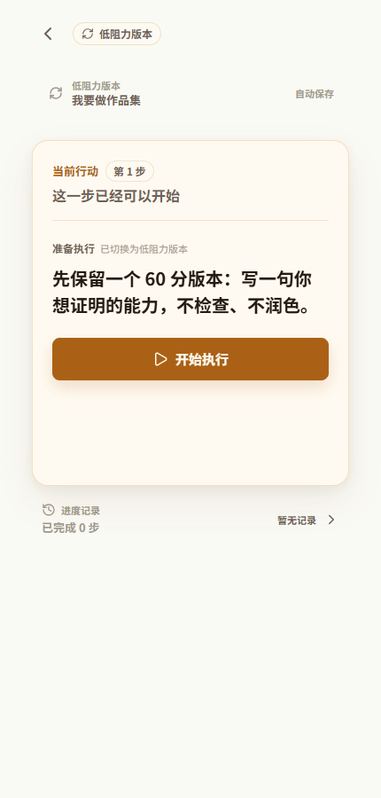

# AI Task Runner MVP



AI Task Runner 是一个面向个人任务启动与推进的 AI 产品体验 MVP。它不先生成一整套计划，而是把用户当前任务收敛成一个低阻力、可立刻执行的步骤，并在用户完成、卡住或信息不足时继续推进。

[项目详情](docs/case-study.md) · [Architecture](docs/architecture.md) 

## 项目定位

这个项目关注的不是“让 AI 给出更多建议”，而是一个更具体的执行问题：

> 用户知道自己要做什么，但不知道现在先做哪一步时，AI 如何把他们带回行动？

核心设计决策是把 AI 放进任务执行闭环，而不是停留在一次性回答：

1. 用户输入一个模糊或高压力任务。
2. 系统生成一个当前可执行动作。
3. 用户开始并完成这一步。
4. 系统基于历史步骤继续生成下一步。
5. 信息不足时先澄清，执行卡住时给出更低阻力的 fallback step。

## 核心功能

- 任务输入：把开放任务转成当前最小可执行动作。
- StepCard：统一承载当前行动、开始执行、完成步骤、卡点入口和恢复入口。
- 连续推进：完成当前步骤后，根据 `stepHistory` 生成自然衔接的下一步。
- 信息澄清：上下文不足时先问一个必要问题，而不是直接猜测。
- 卡点恢复：面对太难、不想做、不确定、状态不适合等阻力，生成更低门槛的下一步。
- 本地持久化：用 `localStorage` 保存任务列表和执行进度。

## 界面预览

| 任务输入 | 当前步骤 | 执行中 |
|---|---|---|
|  |  |  |

| 信息澄清 | 卡点恢复 |
|---|---|
|  |  |

## 技术栈

- Frontend: React, Vite, localStorage
- Backend: Express
- AI Provider: DeepSeek API
- Tests: Node.js scripts, Vite build
- Showcase assets: Chromium capture scripts

## 项目结构

```txt
ai-task-runner-mvp/
  client/          React + Vite frontend
  server/          Express API and AI provider services
  docs/            Architecture, verification and showcase docs
  public/          README cover and portfolio screenshots
  scripts/         Capture and render helper scripts
```

## 本地运行

安装依赖：

```bash
npm install
npm --prefix client install
npm --prefix server install
```

复制环境变量示例：

```bash
cp server/.env.example server/.env
cp client/.env.example client/.env
```

然后在 `server/.env` 填入真实 API key：

```env
DEEPSEEK_API_KEY=your_deepseek_api_key_here
DEEPSEEK_API_URL=https://api.deepseek.com/chat/completions
DEEPSEEK_MODEL=deepseek-chat
PORT=3001
CLIENT_ORIGIN=http://localhost:5173
```

本地 `client/.env` 可保持为空。空值表示前端继续请求相对路径 `/api/...`，由 Vite proxy 转发到本地后端。

启动开发环境：

```bash
npm run dev
```

访问地址：

```txt
Frontend: http://localhost:5173
Backend:  http://localhost:3001
```

## 验证

```bash
npm run build
npm run test:all
```

展示资产可重新生成：

```bash
npm run portfolio:capture
npm run readme:cover
```

`portfolio:capture` 需要先启动前端页面；默认从 `http://127.0.0.1:5173/portfolio-preview` 捕获 5 张关键流程图。当前验证记录见 [docs/verification.md](docs/verification.md)。

## 部署边界

本项目支持前后端分离部署：前端可部署到 Vercel，后端可部署到 Render 或 Railway。真实 AI Key 只应放在后端部署平台环境变量中，不进入前端代码、Vite 变量或 GitHub 仓库。

当前 README 不放线上 Demo 链接；只有在部署地址经过重新验证后，再把真实 URL 加入这里。

## 仓库边界

- `server/.env`、`.env*`、日志、`node_modules/`、`dist/`、`.tmp*/` 和 `video/out/` 不应提交。
- `server/.env.example` 和 `client/.env.example` 只包含占位符，可以提交。
- `public/portfolio/` 只保留 README 和 Case Study 需要的当前展示资产。
- 当前 README 不引用仓库中的旧视频产物；如果后续需要视频，应重新生成并单独验片后再接入。
